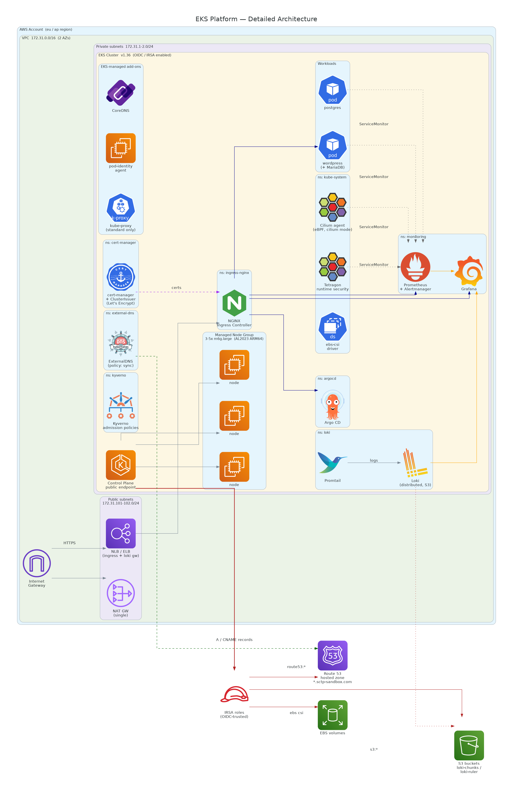
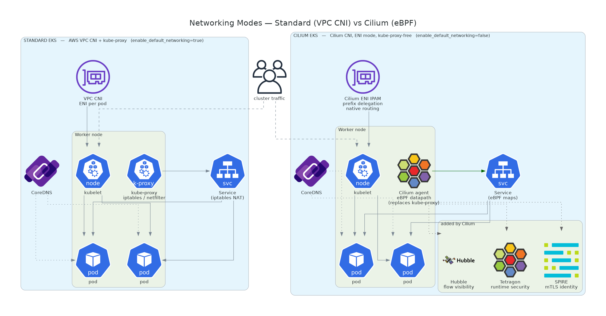
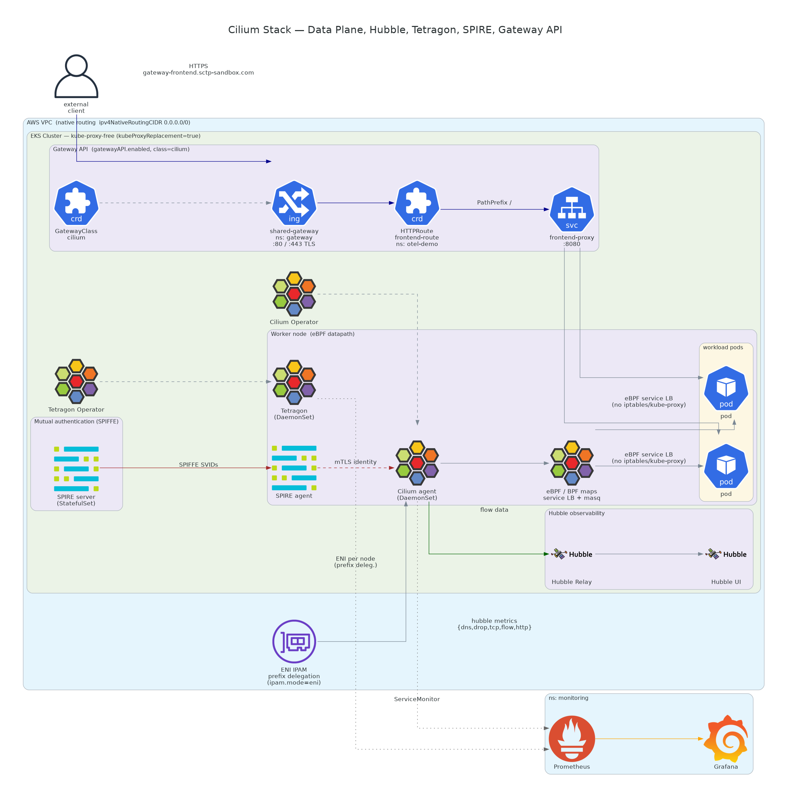
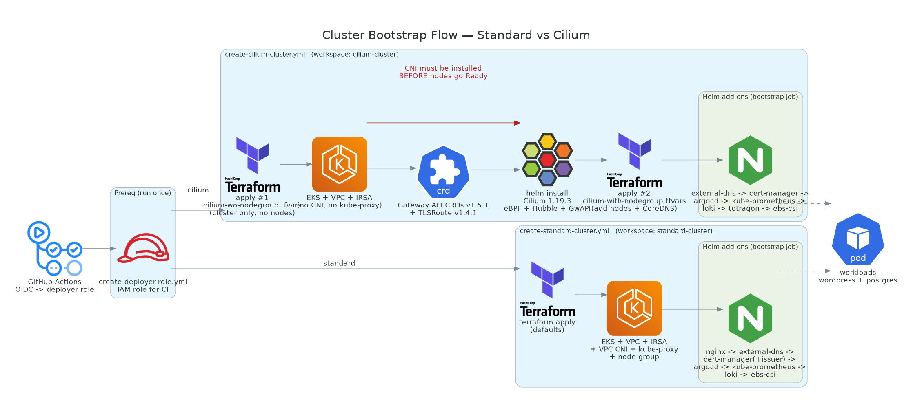

# EKS Platform

[](https://github.com/jaezeu/eks-platform/actions/workflows/terraform-checks.yml)


Terraform and Helm for spinning up demo EKS clusters for a teaching course:
one standard (VPC CNI + NGINX Ingress), one Cilium kube-proxy-free (eBPF +
Gateway API with per-team `ListenerSet`s), plus the add-ons, guardrail
policies and example manifests used in lessons.

> [!WARNING]
> **This provisions billable AWS resources:** an EKS control plane, ARM64 EC2
> node groups, a NAT gateway, load balancers and S3 buckets. Costs accrue while
> the cluster runs. Tear everything down with the
> [`cleanup.yml`](.github/workflows/cleanup.yml) workflow when you are done.

## Prerequisites

### Required Tools

| Tool | Minimum Version | Purpose |
|------|----------------|---------|
| [AWS CLI](https://aws.amazon.com/cli/) | v2.x | AWS resource management |
| [Terraform](https://www.terraform.io/downloads) | v1.14+ | Infrastructure provisioning |
| [kubectl](https://kubernetes.io/docs/tasks/tools/) | v1.35+ | Kubernetes cluster management (cluster runs v1.36) |
| [Helm](https://helm.sh/docs/intro/install/) | v3.12+ | Kubernetes package management |

### AWS Prerequisites

- An IAM user/role with permissions to create:
  - EKS clusters
  - VPC and networking resources
  - IAM roles and policies
  - EC2 instances (for node groups)
  - S3 buckets (for Loki, if enabled)
  - Route53 records (for ExternalDNS, if enabled)
- **AWS CLI configured** with a named profile or default credentials:
  ```bash
  aws configure --profile <your-profile>
  ```

## Architecture Overview



The platform provisions an EKS cluster inside a dedicated VPC, with managed
node groups in private subnets, an in-cluster add-on layer (ingress,
monitoring, GitOps, logging), and IRSA roles granting least-privilege access
to AWS services such as Route 53 and S3.

This repository supports two EKS networking architectures. Use this to decide:

| Feature | **Standard** | **Cilium (kube-proxy free)** |
|---|---|---|
| CNI | AWS VPC CNI | Cilium (ENI mode) |
| Service routing | kube-proxy (iptables) | eBPF datapath |
| Observability | Add-ons only | + Hubble (flow visibility) |
| Runtime security | Add-ons only | + Tetragon |
| mTLS / identity | - | + SPIRE (mutual auth) |
| Ingress | NGINX Ingress | Gateway API (shared `Gateway` + per-app `ListenerSet`) |
| Bootstrap | Single `terraform apply` | Split apply (CNI before nodes) |
| Choose it for | General-purpose workloads, learning | High-performance networking, security & observability deep-dives |



The ordering difference matters at bootstrap: the standard cluster needs the
VPC CNI and kube-proxy add-ons up before node groups attach, while the Cilium
cluster's node groups only become healthy once Cilium itself is installed
(hence the split apply).

The Cilium deployment bundles a full eBPF stack: Hubble for flow visibility,
Tetragon for runtime security, SPIRE for mutual (mTLS) authentication, and the
Gateway API for ingress.



### Gateway API with ListenerSets (Cilium cluster)

The Cilium cluster replaces per-app Ingress objects with the Gateway API's
self-service listener model, using standard-channel
[`ListenerSet`](https://gateway-api.sigs.k8s.io/), a resource that graduated
in Gateway API v1.5 and is implemented by Cilium as of 1.20:

- The platform owns one shared `Gateway` ([addons/cilium/gateway/](addons/cilium/gateway/))
  with a single `:80` listener for ACME HTTP-01 challenges and
  `allowedListeners: All`.
- Each app brings its own HTTPS listener, TLS cert and route from its own
  namespace with a `ListenerSet` + `HTTPRoute` pair. Nothing changes on the
  shared Gateway and no cluster admin is involved. ArgoCD, Prometheus, Grafana
  and Hubble UI are all exposed this way (see `addons/*/gateway-route.yaml`).
- cert-manager issues certs straight off the ListenerSet annotation
  (HTTP-01 via `gatewayHTTPRoute`) and ExternalDNS publishes each route's
  hostname, so once the ListenerSet is applied the rest is automatic.

The [gateway-api-coaching](deployment-manifests-examples/gateway-api-coaching/)
example walks through the same pattern side by side with its classic
[ingress-coaching](deployment-manifests-examples/ingress-coaching/) equivalent.

> Diagrams are generated as code with [`diagrams`](https://diagrams.mingrammer.com/);
> see [docs/diagrams/](docs/diagrams/) to regenerate them.

## Repository Structure

| Directory | What it is |
|-----------|------------|
| [terraform/eks-cluster/](terraform/eks-cluster/) | The cluster itself: VPC, EKS, node groups, IRSA roles. `.tfvars` files select standard vs Cilium mode. |
| [terraform/eks-cluster-deployer-role/](terraform/eks-cluster-deployer-role/) | Bootstrap step: the IAM role (GitHub OIDC) that the workflows assume. Run once, first. |
| [addons/](addons/) | One directory per Helm add-on (argocd, cert-manager, cilium, ebs-csi-driver, kube-prometheus-stack, kyverno, loki, nginx-ingress, r53-externaldns). Each has its values file(s) and an `init.sh`. |
| [kyverno-policies/](kyverno-policies/) | The guardrail admission policies that `addons/kyverno` enforces. `gateway-api/` subfolder applies only on Cilium clusters. |
| [applications/](applications/) | Sample Helm workloads (postgres, wordpress) used in lessons. |
| [deployment-manifests-examples/](deployment-manifests-examples/) | Plain-manifest teaching examples. `ingress-coaching/` targets the standard cluster, `gateway-api-coaching/` the Cilium one. |
| [scripts/](scripts/) | Learner namespace provisioning and the add-on render/validation check CI uses. |
| [docs/](docs/) | Architecture diagrams as code, plus the rendered images. |
| [.github/workflows/](.github/workflows/) | Cluster create/cleanup workflows and CI checks. |

## Quick Start

The cluster is bootstrapped in a fixed order: deployer role, Terraform, CNI,
node groups, add-ons, then workloads.



Use the workflows in `.github/workflows` to create and destroy clusters:

- `create-deployer-role.yml` - creates the IAM role the other workflows assume (run first)
- `create-standard-cluster.yml` - standard cluster: VPC CNI + add-ons
- `create-cilium-cluster.yml` - Cilium cluster: Cilium CNI + add-ons
- `cleanup.yml` - tears down everything the cluster workflows created

> [!NOTE]
> **The deployer role uses `AdministratorAccess`.** This is a deliberate
> tradeoff for a sandbox teaching account: the workflows create IAM roles, VPCs,
> EKS clusters and S3 buckets, and keeping the policy broad avoids
> permission-debugging during lessons. Do **not** copy this pattern to a
> production account; scope the role down to the specific services Terraform
> manages there.

Once the cluster is up, point kubectl at it and check that nodes and add-ons
are healthy:

```bash
aws eks update-kubeconfig --name <your-cluster-name> --region <your-region> --profile <your-profile>
kubectl get nodes
kubectl get pods -A
```

## Fork & adapt

Course-specific values are hardcoded on purpose: the values files and example
manifests double as teaching references, and concrete hostnames beat
placeholders for that. (Helmfile and Kustomize overlays were considered and
rejected as abstraction this repo doesn't need.) To run the platform in your
own environment there are only a few knobs:

| Knob | Current value | Where to change it |
|------|---------------|--------------------|
| Base domain | `sctp-sandbox.com` | Hostnames in add-on values, `gateway-route.yaml` files, Kyverno host policies, and examples (find them all with `grep -rl sctp-sandbox.com`) |
| Route53 zone | `Z00541411…` | `external_dns_hosted_zone_arns` in [terraform/eks-cluster/variables.tf](terraform/eks-cluster/variables.tf) (scopes the ExternalDNS IAM role) |
| Learner namespace pattern | `*-eks-activity` | [kyverno-policies/restrict-namespace-name-format.yaml](kyverno-policies/restrict-namespace-name-format.yaml) and [scripts/](scripts/) |
| AWS account | (per fork) | `ACCOUNT_ID` GitHub Actions **variable** |
| ACME registration email | (per fork) | `EMAIL_ADDRESS` GitHub Actions **secret** |

> Tip: lower your Route53 zone's SOA negative-cache TTL from the default 900s
> to something like 60s. Otherwise, first-time certificate issuance self-checks
> wait out cached NXDOMAIN responses for up to 15 minutes after ExternalDNS
> creates a record.

## Contributing

See [CONTRIBUTING.md](CONTRIBUTING.md). The short version: conventional
commits, run the CI checks locally, keep PRs small.

## License

See [LICENSE](LICENSE).
